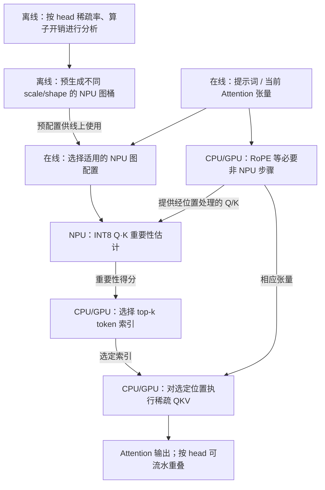

# 第 5 页：优化 NPU 会改变 CPU 的执行边界

> **已对照** ShadowNPU arXiv 2508.16703 v4，第 3.1–3.4 节及 Fig. 5。另参照 [llm.npu](https://doi.org/10.1145/3669940.3707239)。这里是**两篇论文的对比展示**，绝非一套串联执行的算法。

**图题**：NPU 软件能力进化后，为什么原有 CPU/GPU 回退范围会缩小？

图面分成两个彼此独立的 panel：左侧 llm.npu 的“图编译/调度改进”文字机制简述；右侧 ShadowNPU 依照 Fig. 5 展开，不在两条路径之间画数据箭头。下述 Mermaid **只定义 ShadowNPU 的简化步骤**：

**逻辑边界与原文**：
- Fig. 5 展示离线 profile / graph buckets、线上 NPU-centered graph、RoPE 与 sparse attention 的分工；这里删去内部部分边以保持可读，标“依据论文方法简化重绘”。
- top-k 的职责是 CPU/GPU 上选择重要 token；不是 NPU 输出最终高精度 Attention。head-wise pipeline 是时间重叠关系，不应画成每个 head 串行完全等待。
- llm.npu 的具体“优化项→硬件映射”须单独核对原方法后再制作左图。当前不能把 ShadowNPU 的机制说成 llm.npu 自身的方法。
- 不能泛称“所有 Decode attention 已完全迁至 NPU”，也不能将两篇的加速数字相乘；若引用原图应标注 Fig. 5 与原文许可。

**论文**：[ShadowNPU/MobiSys 2026](https://doi.org/10.1145/3745756.3809205) · [arXiv 全文](https://arxiv.org/pdf/2508.16703) · [llm.npu](https://doi.org/10.1145/3669940.3707239)。
