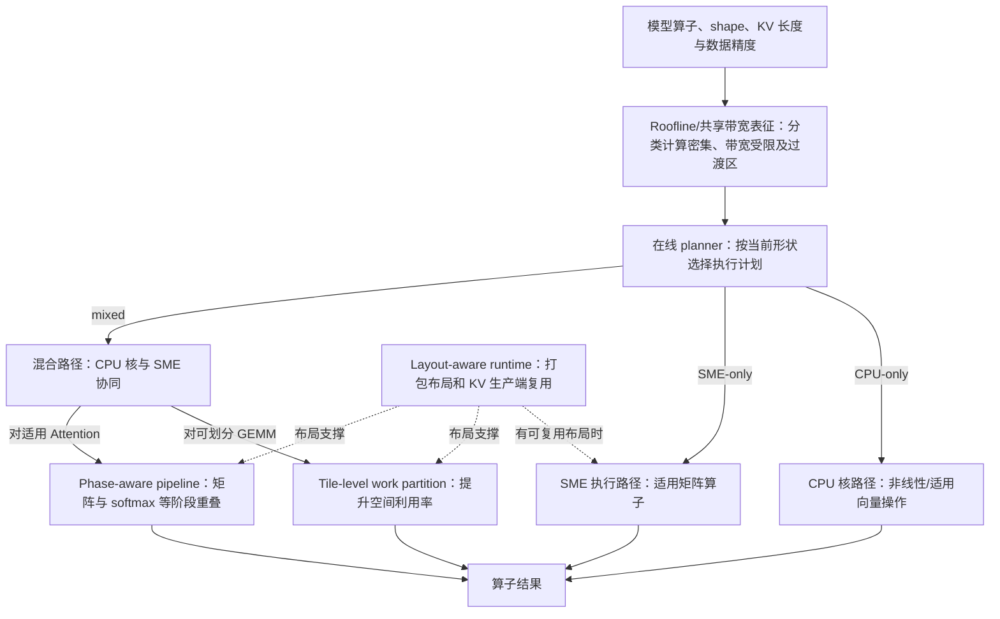

# 第 7 页：SMEPilot 的执行选择为什么不仅是换一个 SME Kernel？

> **原文核对**：[SMEPilot](https://arxiv.org/pdf/2606.16332) §3.3–4.4，Fig. 2、Fig. 5。作者区分 CPU cores 与 SME unit；二者属于同一 CPU/cluster 架构范畴，共享内存带宽，**不是 CPU 与独立手机 NPU 的横向比较**。

**图题**：为何要按算子形状规划 CPU、SME 及二者协同，才能避免空闲与重复数据转换？

**重要区别**：
- mixed 分支里的 Tile Partition 与 Phase Pipeline 面向**不同算子条件**，并非每个混合请求都必须依次执行这两项。
- Layout-aware runtime 是跨路径的**张量布局管理能力**，不是“新的独立硬件缓存”，不应画成 CPU 核或 SME 的上级硬件。
- SME 是 CPU 体系内的矩阵扩展执行单元，论文 Fig. 1 展示其与 CPU 核共同存在的硬件组织；不要画成 SoC 中独立 NPU。
- Ablation 具体数据另作真实柱图；3.94× 为特定配置的最大端到端结果而非普适手机速度或能耗。

**论文**：[SMEPilot 原文](https://arxiv.org/pdf/2606.16332)。
