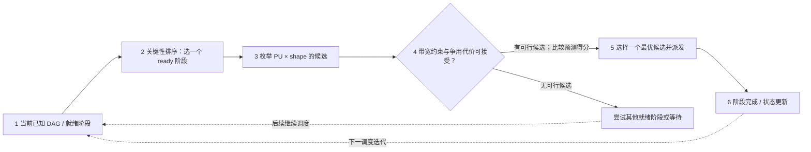

# 第 8 页 HeRo：失败复盘与正式重新制图合同 v2

日期：2026-10-08。**当前 Round15K 第 8 页 PNG/PPTX 判定为不通过，禁止继续作为后续模板**。用户反馈：“左边的流程框图，引导线是乱的，无法理解。” 本文件优先于 [page-08-hero-runtime.md](page-08-hero-runtime.md)、[hero-semantic-graph.dot](hero-semantic-graph.dot) 和首版试制记录中涉及**第 8 页制图方式**的部分；旧文件留存供审计，不作为可用成品。

## 1. 本次重新核查的证据与范围

- 原论文：[HeRo: Adaptive Orchestration of Agentic RAG on Heterogeneous Mobile SoC](https://arxiv.org/pdf/2603.01661)，§3.1–3.3、§4.1–4.2（含 Eq. 2–5 和 **Algorithm 1**）、**Figure 4(a-d)** 的文字/图注以及 Table 3。
- 本轮已经核对公开全文 Methods、公式、算法步骤、Figure 4 四个子图的标题/图注、并复查实际 PPT 导出 PNG、Graphviz DOT 渲染图和原生 PPT 画线源码。**PDF Figure 4 图像本身未能以截图方式取得，不得宣称逐像素/逐形状抄绘审计已经完成**。
- 原 Figure 4 展示 (a) Stage Partition、(b) Priority on Dynamic Graph、(c) Bandwidth Contention Control、(d) Framework Workflow；Algorithm 1 给出 Node-centric Online Heterogeneous RAG Scheduler。本轮旧图是对这些机制的**作者之外的自行综合抽象**，既不是原 Figure 4(d) 的逐模块简化复刻，也不是未经更动的论文图片。

## 2. 旧设计为什么失败（分层判责）

**第一层，Markdown 逻辑缺陷（较重）**：将“任务/依赖 DAG（运行时被调度对象）”、“shape/代价（profiling 和候选配置）”、“DAG criticality（优先级）”、“shared DRAM（资源容量与干扰约束）”全部写成同一张泛化控制图，却没有突出 HeRo Algorithm 1 的确定主语义：**Ready set → criticality → candidate stage → feasible PU/shape → contention gate/scoring → dispatch → observe completion and update**。缺少“候选 config/评分/过滤/dispatch”的决策语义，单看老箭头不易知道为什么软件优化有效。

**第二层，DOT 自动布局问题（明确）**：原 DOT 具有大量交叉反馈边；`splines=ortho` 与普通 edge labels 在 Graphviz 中发出 `Orthogonal edges do not currently handle edge labels` 警告，实际渲染的长虚线回环挤压主路径。DOT 结构引用闭合并不表示图的阅读路径通顺。

**第三层，PPT 手动转绘问题（最直接）**：`make_slide8.js` 没有导入 DOT 的几何布线，而是手写 `l/elbow` 坐标；三个 input factor 共用无说明的横向汇线；DAG→scheduler 主箭头又绕开这些 input 造成二义性；PU 的三个分支从同一长水平线发散；最严重的是用底部**说明框**作为反馈线出发点，而不从 CPU/GPU/NPU 的执行完成节点出发。图形文字表示“完成/资源反馈”，但实际 PPT 缺失显式执行完成节点/起点。**已通过图形结构静态检查也没有阻止这类视觉—拓扑漂移**。

**结论**：不是 Image Generator 绘坏了流程线。背景由 Image Generator 提供，问题发生在设计语义和原生 PPT 手工布线阶段。

## 3. 从论文 Algorithm 1 提取的最小主循环（供制作验收）

这张图回答的是：**HeRo 在线调度如何使用任务依赖、硬件适配性和内存带宽信息，作出一次阶段派发决定？**

### 语义定义

| ID | 用户可见标签 | 实际含义 | 论文锚点 |
|---|---|---|---|
| H1 | 部分可见 DAG 和就绪阶段 | 更新 `Gobs(t)` 与 `R(t)`；动态工作流的可见部分 | §3.1, Algorithm 1 line 3 |
| H2 | 评估关键性，优先选择就绪任务 | 结合当前已知依赖、可能后续关键性，选 `v_cand` | §4.2 Eq.4, Algorithm 1 lines 4–8 |
| H3 | 枚举可行 PU × shape 候选 | 对可运行该节点的 CPU/GPU/NPU 与 shape-aware configurations 枚举，利用离线 profile | §4.2 Eq.3, Algorithm 1 lines 9–10 |
| H4 | 带宽约束和代价评分 | 排除超过 `B_soft` 的配置，并计入完成时间和临界路径争用惩罚 | §4.2 Eq.5, Algorithm 1 lines 11–16 |
| H5 | 派发到选中的 PU | 选预测目标最好的一项而非向 CPU/GPU/NPU 全部派发 | Algorithm 1 line 17 |
| H6 | 完成后更新状态，进入下一轮 | 更新 ready DAG、活动节点、可用资源和带宽负载 | Algorithm 1 lines 18–20 |
| HE | 离线剖析结果 | 各模型/PU/shape 的运行时间、带宽、干扰模型 | §3.2，Algorithm 1 inputs |
| HW | 无候选可执行的处理 | 尝试下一个 criticality ready node 或等待状态变化 | Algorithm 1 line 15/20 |

### 精简 Mermaid **仅作为逻辑协议，不强制最终使用此布局**

**严格解释**：H4 的“可接受”须包含带宽阈值和干扰评分，不能误读为“只有超过某固定比例就不执行”。HE 离线 profile 应以**同一独立输入注释/数据带**说明它作用于 H3 与 H4；若额外加入箭头，必须明确是支持输入，不是任务时间顺序。H1→H6 描述调度循环的主要推理，不等于实际每次所有阶段都做同样的运行时重编译。

## 4. 新的视觉布局禁令与验收规格

**画面左侧不要再尝试“一张大图承载所有系统依赖”。**

- 主路径：**一条横向读图顺序**，最多 5 个主体模块，采用 H1（DAG/ready）→ H2（优先级）→ H3（PU×shape 候选）→ H4（带宽/争用过滤）→ H5（只派发选中一个 PU）。用数字 1–5 标示，确保 16:9 投影可读。
- H6（完成/更新）放在最右下单独“下一次调度循环”说明区。如空间不足，用明确标注“完成后更新 ready set，进入下一轮”代替巨型环绕返回箭头；**不要画一条必须绕过整个图的线**。
- 相关离线 profiling 数据放在主图下方薄长框，写“支撑阶段3和4”，不画三根无标注箭头挤入中间节点。
- CPU、GPU、NPU 只在 H5 旁用**三项可选标签**，例如“所选 PU ∈ {CPU,GPU,NPU}”，不要画 3 条长距离 fan-out；论文说每个 stage 选一个 PU。
- 不能从说明文本卡片生成状态反馈边。最终在 PPT 里任何 connector 的可见起点和终点都必须能对应本文件 ID。
- 若需要具体 RAG 子任务 DAG，另做小而独立的**任务依赖示意**，不要和调度器算法上的控制关系混在一起。
- 右侧 Table 3 两组消融数据仍可保留，但 C1/C2 的 workload/model/设备及 baseline 应写明：“Ayo-like static mapping”；两组为不同实验配置。数据不属于流程图边。

### 新增必须通过的 QA

1. 技术：从论文 §4.2 和 Algorithm 1 明确对应到画面 1–5 主路径，无主张“真实 Figure 4 直接重绘”。
2. 结构：实际 PPT 中每条可见线做 **source → target → type/label** 抽样/全量核对，不能只检查 DOT 代码闭合。
3. 布局：任何箭头不得跨过无关节点或正文；完成反馈不得从文字说明框出发；反馈通路最多一条独立带。
4. 可读性：隐藏说明段落后，5 个模块标题仍可读出主要算法；看不懂“哪个箭头从哪里来”即判失败。
5. 完成后重新导出 PNG，在屏幕尺寸和演示投影尺度各检查一次。

## 5. 已有成品状态

`round15k_slide08_hero_editable.pptx` 和 `round15k_slide08_hero_preview.png` 仅作为**失败案例保留**，不可列为“可用试制页”。第 6 页 SME2 的视觉方向仍可作为配色与数据图的参考，但其接受不意味着第 8 页通过。
