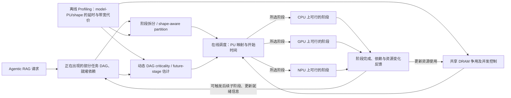

# 第 8 页：HeRo 如何利用动态 DAG、shape 与共享带宽？

> **原文核对**：[HeRo](https://arxiv.org/pdf/2603.01661) §3.1–4.2、Figure 4，Table 3。当前 diagram 只作为“机制忠实的概念摘要”，不冒充真实源码结构或固定调度 API。

**图题**：动态 Agent RAG 的阶段如何随依赖、设备适配性和共享带宽约束被安排到 CPU/GPU/NPU？

**审计注记**：
- 在线调度关注 shape-sensitive partition、关键性和 shared bandwidth；离线 profile 是成本模型输入。此 Mermaid 不表示三类决策必须严格串行执行。
- CPU/GPU/NPU 是可选的 stage 映射目标，不表示一个 stage 同时派发到三个 PU。
- 论文 Table 3：C1 = 8 Gen 4 上 Qwen3/Workflow 2/FinqaBench；C2 = 8 Gen 4 上 BGE/Workflow 3/2WikiQA。基线为 Ayo-like 静态映射。C1 **5.79→3.82s**；C2 **17.23→5.38s**，对应论文中的组合组件消融；两者不要当作同一次工作流测试。
- 最高 **10.94×** 必须注明对应图、受测配置与所比较 baseline，不能与上述 C1/C2 数值相乘或合并。
- 正式制作优先对照论文 Figure 4 (a-d)；这里保留图形逻辑而非全部原生算法细节。

**论文**：[HeRo 原文](https://arxiv.org/pdf/2603.01661)。
