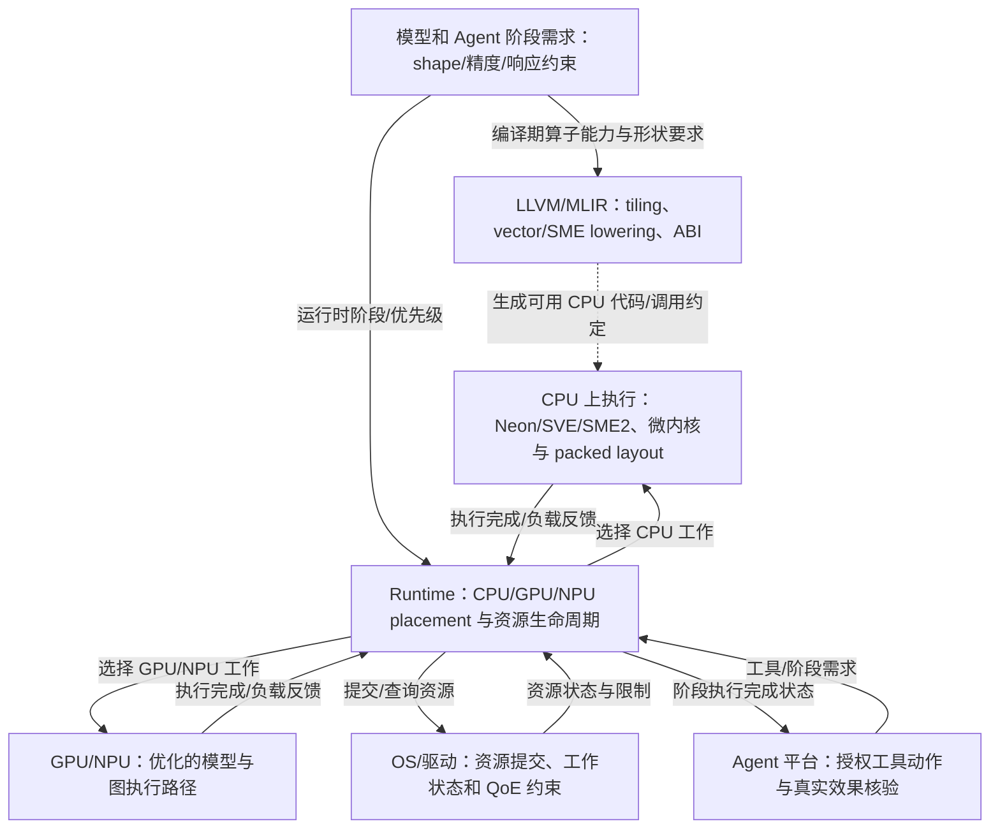

# 第 9 页：把 CPU 编译能力与跨引擎 Runtime 责任分清

> **架构综合推断**，不是某单篇论文的系统原图。依据公开 LLVM/MLIR SME 文档、Arm KleidiAI、HeRo 和既有软件 Runtime 机制；图中不宣称已经存在统一的跨厂商软件 API。

**图题**：哪些性能接口可由 CPU/LLVM 直接推动，哪些必须依靠 Runtime/OS 与 NPU 软件协作？

**审计说明**：LLVM 不是与 CPU/NPU 同列的硬件执行器；CPU 路径和 GPU/NPU 路径在 runtime 之下并列。R↔O 为 OS/driver 公开功能抽象而非单一真实 API。Agent 可信工具动作由 Agent/OS 平台主导，不应把整个方向归入 CPU-uArch 团队专属所有权。真实责任人/预算不在公开研究中产生。

**来源**：[LLVM AArch64SME](https://llvm.org/docs/AArch64SME.html) · [MLIR ArmSME](https://mlir.llvm.org/docs/Dialects/ArmSME/) · [KleidiAI](https://github.com/ARM-software/kleidiai) · [研究综合](https://github.com/xjs-work-lab/agentic-CPU-uArch/blob/main/analysis/engineering/round15f-cpu-llvm-compiler-pressure-2026-10-08.md)。
