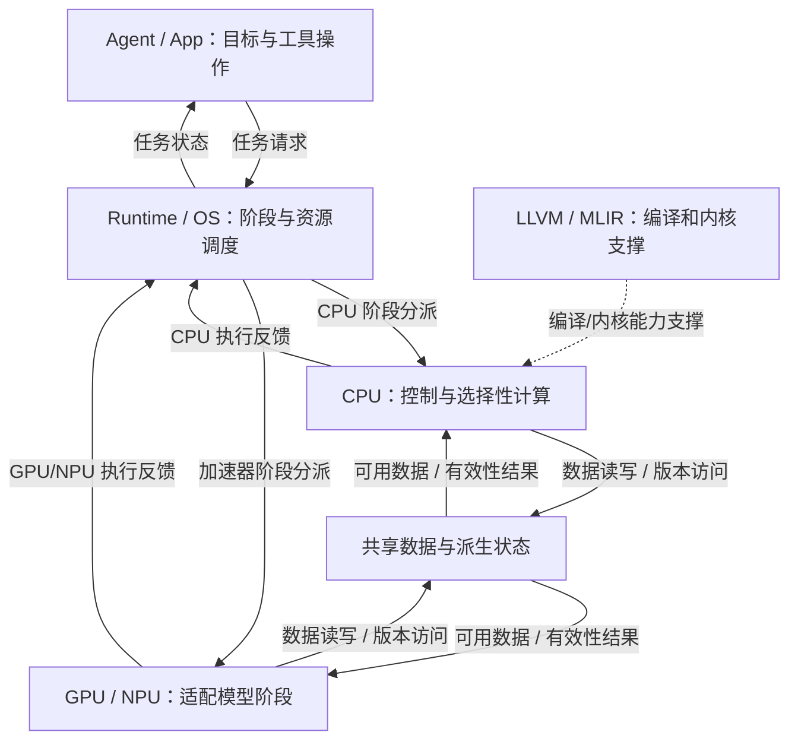
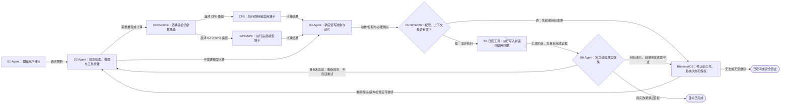
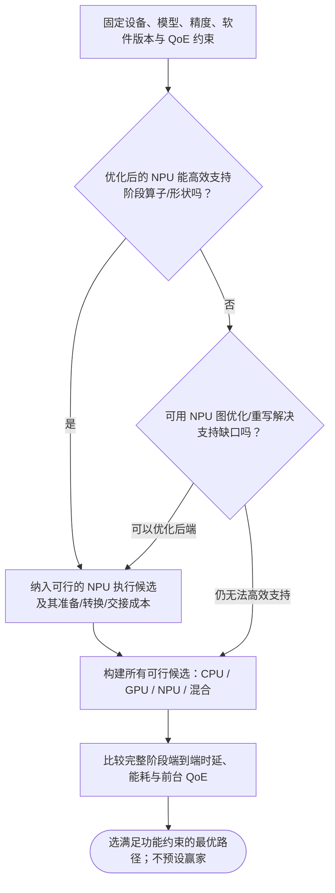

# 前三页 Mermaid 逻辑权威规格 v1

日期：2026-10-08。基于 [经过结构审计的 v2 合同](slide-content-contract-01-03-v2-structure-audited-2026-10-08.md)。本文件作为前三页**图形拓扑**的权威来源；文案仍由 [内容合同 v1](slide-content-contract-01-03-v1-2026-10-08.md) 管理。如本文件与旧版结构文字冲突，以本文件为准。Mermaid 图是逻辑草图，不作为最终 PPT 视觉样式。节点 ID 只用于制作环节，不在汇报正文显示。

## 制图语义规则
- 任何箭头的两端必须是 Mermaid 中已声明的节点；显示名称与软件/硬件类型不准默默互换。
- 实线：概念性的任务、执行、数据、结果关系；虚线：编译支撑或可选旁路；流程分支的标签必须显式。
- 关系图不必是物理 SoC wiring；Runtime 对 CPU/NPU 的调用与交接只是**软件抽象**，不得冒充直接硬件控制线。
- Mermaid 的排版方向是逻辑阅读方向的参考；最终由 Image Generator/精确排版保留关系，允许改变颜色、图标、曲率、卡片形状。
- 对等价结构施加验收：点集和边集、边标签、分支含义、终态、证据属性均不得丢失；无实证性能数值不得画出定量数据图。

## 第一页：跨层任务执行与软件支撑

**这张图要证明什么？** Agent 任务首先由软件 Runtime/OS 拆成不同执行阶段，CPU 与 GPU/NPU 是平行的执行资源；LLVM/MLIR 只是 CPU 路径的编译支撑。数据状态可为两条执行路径所用，但不代表 CPU 直接统管 NPU。

制作限定：C 与 N 在同一执行层，L 在 C 侧边，不是单列 CPU→NPU；结果反馈线路可在版面侧边汇集，但语义上 C、N 必须分别反馈 R。GPU/NPU 此处仅是两个异构处理器的视觉合组，不表示同一引擎。M 是**抽象共享数据/状态层**，不强加实际存储一致性实现。投资判断三块照文案合同单列于图右侧。

## 第二页：从计划到真实工具效果的动态执行

**要证明什么？** 一次 Agent 任务不是推理后结束，而是经历计划、可选推理、授权、真实操作及效果验证；失败重规划与取消终止不同。

六个阶段 S1–S6 是**阅读时间列**，而下面 A/R/C/N/T 是职责泳道，不是互相替代的节点序号。建议将图分成主业务流程和 CPU/NPU 阶段选择的小型支撑图区，不要在一张画面里塞满 5×6 单元格。

**边界说明**：此图不宣称所有日程动作都必须弹窗确认；只在权限或风险要求时获取确认。R3→C3 与 R3→N3 表示按阶段选择的可能路径，**不表示每次必定并行执行**。A6 核验应依赖可查询外部效果，不能把 T5 的返回码等同目标成功。可选择的阶段执行/外部读日历可能重复，本图仅说明关键结构，不是完整手机操作 trace。

## 第三页：先比较可行路径，再选择最低总成本

**要证明什么？** 应按同设备同模型下的完整阶段成本及 QoE 而非 TOPS 判断 CPU/NPU；不能默认 NPU 不支持时永远走 CPU，也不能从抽象图推导出胜者。

**配套表格不是流程图**：左侧四行“长 Prefill / 短 Decode / 精度敏感 Attention / 工具控制”，每行沿“特征 → 显著成本 → 执行分工含义”阅读，不给行与行添加逻辑箭头。端到端时间分解的五个名词只是可能的系统成本项目：考虑流水重叠、复用与依赖，不能简单把五个独立量相加当作普遍实测。

## 审计与绘制 Gate

1. Mermaid 本身必须可解析渲染；所有节点唯一、所有边有合法起点和终点、判断条件的分支能够闭合到终态（流程图）。
2. 第 1 页的软件/硬件分层清晰，不将 LLVM 画成 GPU/NPU 的物理执行单元。
3. 第 2 页两终态不混淆；验证失败、授权失效和主动取消的分支标签不同。
4. 第 3 页须在**相同运行条件**比较，不画未经公开数据证实的 CPU/NPU 获胜结论。
5. 最终幻灯片可以不使用 Mermaid 美术外观，但不得违背节点和关系语义。
6. 引用继续使用内容合同中的论文、官方与 GitHub 网址；PNG 显示来源文字，PPTX 嵌入可点击链接。
7. 后续第 4–15 页只有含有流程/层级/状态机/时序的技术图才使用 Mermaid；论文数值图、时间矩阵和投资组合仍依赖适合的图表规格。
