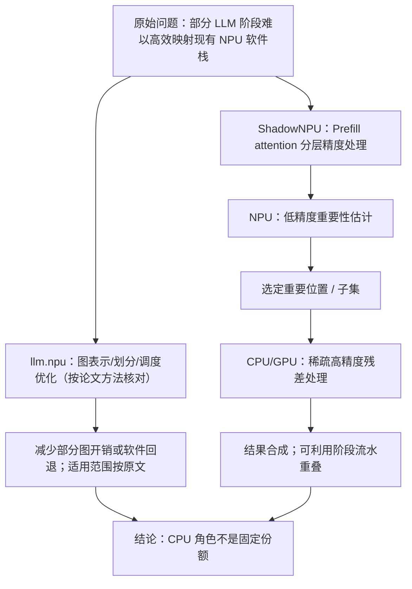
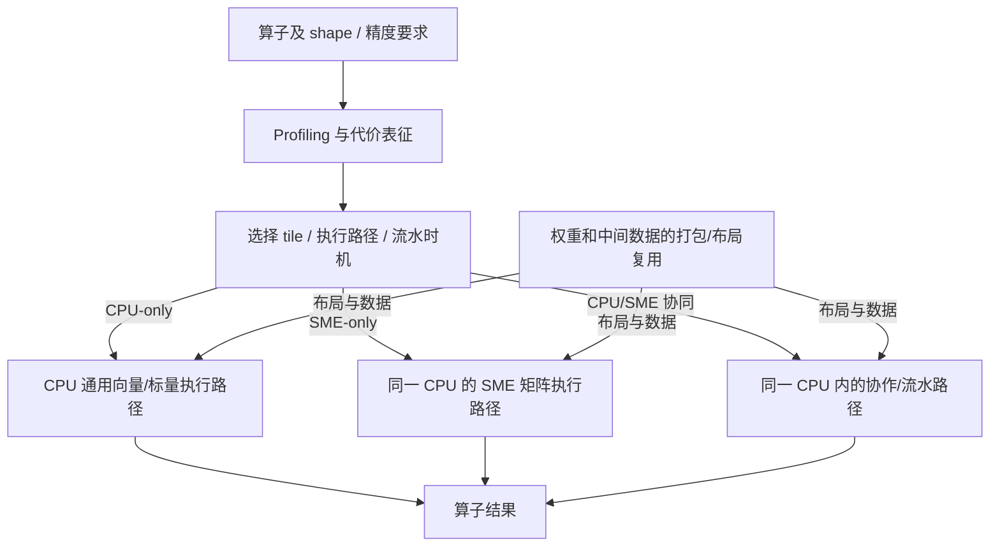
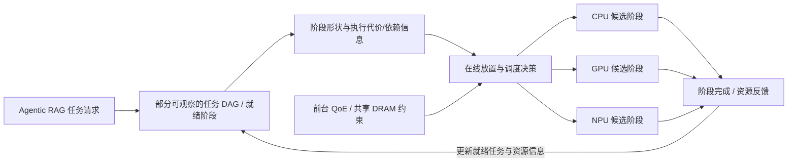
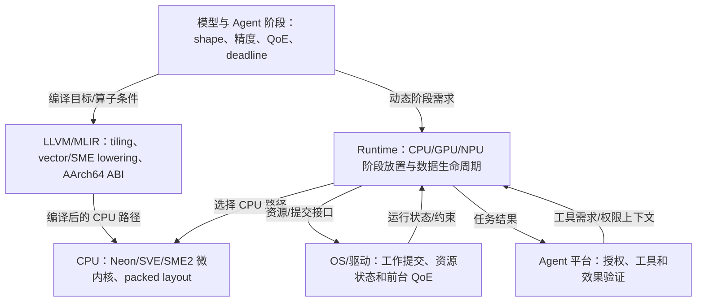
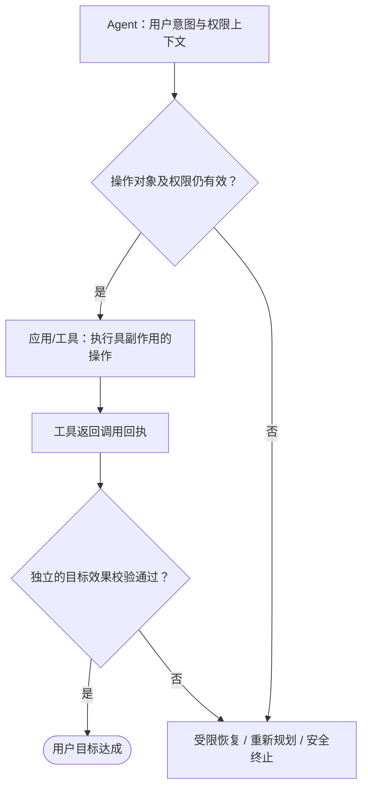
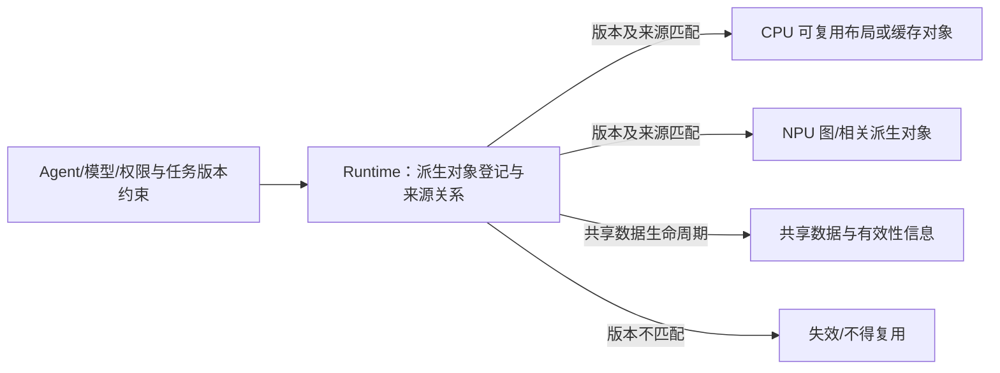
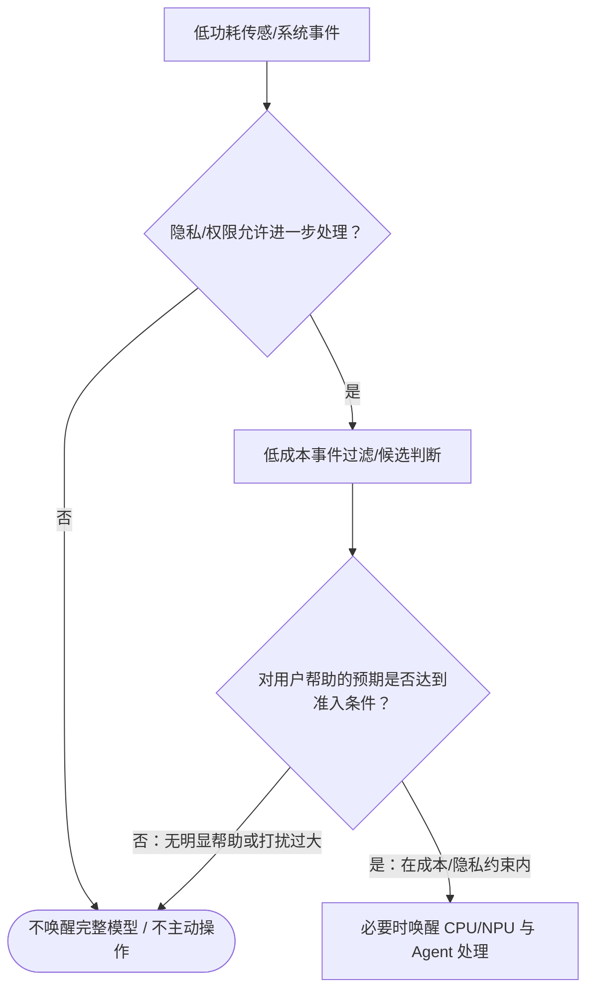
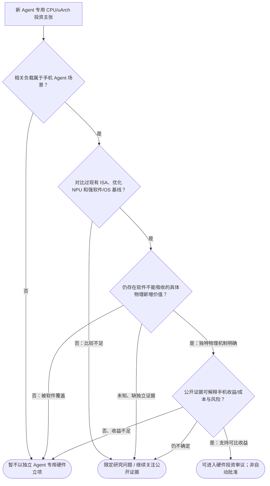

# 第 4–15 页：图形逻辑审计与 Mermaid 制图规格 v1

日期：2026-10-08。来源：[15 页总体蓝图](content-storyboard-v1-2026-10-08.md)、[正式公开证据报告](../management-final-public-evidence-2027-2029.md)、[当前投资组合](../current.md)；前三页标准见 [Mermaid 逻辑规格](slide-01-03-mermaid-logic-spec-v1-2026-10-08.md)。

**状态：设计级逻辑审计和初版规格，不是论文原文、图号、数值复核已通过；还未生成或测试本文件中的所有 Mermaid。** 主标题、精确科学结论、数字、来源仍须以研究 SSOT 与原始论文为准。流程描述中的解释性节点不能被写成论文原有组件。图形视觉可由 Image Generator 自由设计，但节点/箭头/实验证据不能自由发明。

## 一、页面类型选择

| 页 | 图形主任务 | 合适工具 | 内容边界 |
|---|---|---|---|
| 4 | CPU/NPU 三个对照口径的真实数据 | 原论文图/数值重绘 + 小型机制框图 | 分母、同机软件栈、Prefill/Decode kernel/E2E 不得混合 |
| 5 | 软件改进如何改变 CPU/NPU 分工 | **Mermaid 方法摘要** + 核对后的论文架构图 | llm.npu 与 ShadowNPU 必须区分，不能伪称一套统一算法 |
| 6 | 同一 CPU 的 SME2 on/off 真实数字 | 实数轴比较条 + 数据布局概念图 | 不是 NPU/Agent 实验 |
| 7 | SMEPilot 规划、角色分配与复用 | **Mermaid 方法摘要** + Ablation 图 | CPU/SME 指同一 CPU 中的通用与 SME 执行方式，非两颗独立引擎 |
| 8 | Agent DAG + HeRo 资源协调 | **Mermaid DAG/调度逻辑** + 原论文数值 | 查询/检索/重排/生成仅是示意阶段，不伪称固定 DAG |
| 9 | 编译/CPU/Runtime/OS 的可控接口 | **Mermaid 分层依赖** | 不把编译器、CPU、OS 画为对等硬件执行器 |
| 10 | 信任行为与派生计算状态 | **两个不同泳道/关系图** | 工具合法性和缓存有效性不是同一状态机 |
| 11 | 低功耗事件准入 | **Mermaid 条件树** | 现有 CHRE 等能力为基线，不是独立 Agent 低功耗 IP 证据 |
| 12 | 新硬件价值如何成立 | **Mermaid 决策门槛** | 证据不够时应保留问题或否决当前立项，而非宣布技术永无价值 |
| 13 | Build/Reserve/Watch/Kill | 结构化投资矩阵 | 工程 3、研究储备 3、独立新硅片 Bet 0 |
| 14 | 2027–2029 技术路线 | 年份×技术层矩阵 | 不是公司已审批排期或 OEM 量产承诺 |
| 15 | 证据与管理决策映射 | 三列决策表 | 组织所有权为建议，不虚构负责人/预算 |

## 二、第 4 页：量化证据审计（不以 Mermaid 为主图）

**主图**三个单独 panel：Prefill、Decode kernel、Decode E2E。每个 panel 均有：原论文实验设备、模型、后端、指标与单位、具体被除数/除数、方向（快/慢）和注释。不能将“1.27–1.62 倍较慢”和“1.55–1.67 倍较快”绘在统一无基准“加速比”轴上。**数据核验 gate**：制作前核对 [When NPUs Are Not Always Faster](https://arxiv.org/abs/2605.27435) 的图号、实际模型条件、测量统计及比值定义；若任何数值未完成核对就仅保留描述和来源，不生成看似确定的图形。

辅图仅可用概念链：stage 输入 → 后端图执行和支持情况 → 数据准备/CPU fallback/同步 → 完整阶段结果。各因素可能并行或被摊销，不画成实测的必定串行时序。

## 三、第 5 页：区分两篇论文的 NPU 软件增强机制

**要证明**：CPU/NPU 的执行边界会随图编译、精度表示和流水执行而改变。下图是跨论文的**对照式方法抽象**，不是论文的统一真实执行路径。

**技术守门**：ShadowNPU 的 Decode 与 Prefill 路径不能合并夸大；“把工作重新交给 NPU”不是指全部 attention 已移至 NPU；两篇研究的作者关系、平台、模型、性能口径需分别列示。论文：[llm.npu](https://doi.org/10.1145/3669940.3707239)、[ShadowNPU](https://doi.org/10.1145/3745756.3809205)。

## 四、第 6 页：SME2 数据图规格

主图只有同设备、同 CPU 路径的两组 on/off 成对横向柱：INT8 555.8→304.1ms、FP16 1163.0→298.2ms；原始时间单位 ms、方向“越低越好”，绝不把原数改造成无说明的加速比。后优化阶段 data movement INT8 41.4%、FP16 39.9%，另作真实百分比条并注明来自原文不同量纲。**数据核验 gate**：以 [PyTorch/Arm 官方博客](https://pytorch.org/blog/accelerating-on-device-ml-inference-with-executorch-and-arm-sme2/) 的 SqueezeSAM/vivo X300/Normal mode/单 CPU 核条件为准。辅图只说明 packing/data movement/SME kernel 之间有性能耦合，**不声称 L1/L2 真正的具体路径或比例已经测得**。

## 五、第 7 页：SMEPilot CPU 内部执行方式

**重要修正**：SME 不应在视觉上成为与 CPU 并列的独立 SoC 处理器。图为来自 [SMEPilot](https://arxiv.org/abs/2606.16332) Methods 的抽象制作意图，不能假装精确复现内部所有 planner 分支。Ablation 3 组分开注原设备、操作（移除了哪项）、实际指标、单位和比较基线；“最高 3.94×”只属于指定测试配置。确认原论文 fig/table 后再可使用真实数字。

## 六、第 8 页：HeRo Agent DAG 与在线资源安排

**关键边界**：这是系统功能抽象，而非宣称 HeRo 用了与图完全相同的 runtime API；具体 DAG/criticality/edge 推理必须核对 [HeRo](https://arxiv.org/abs/2603.01661) 的实际 Method/Figure。主图不能把 query rewrite→retrieval→rerank→generate 描绘成所有 Agent 的唯一固定顺序。数据旁列 up to 10.94× 指定 GPU-only 比较，C1 5.79→3.82s、C2 17.23→5.38s 是**另两组独立的 ablation 条件**，不能串成一次 10.94× 的整体收益。

## 七、第 9 页：五类技术能力的依赖、而非串行硬件流

K 是物理 CPU 上的执行代码及软件 kernel 能力；B 是编译时软件，R/O/A 是运行时/系统/Agent 层。此图**不代表编译器直接给 CPU 发运行时控制命令**。若需要新增实际 NPU 节点，可由 R 分派到并列的 GPU/NPU 节点，并定义真实反馈，不能为了画面简洁而让 CPU 看似承包所有执行。

原始接口：[LLVM AArch64 SME](https://llvm.org/docs/AArch64SME.html)、[ArmSME MLIR](https://mlir.llvm.org/docs/Dialects/ArmSME/)、[KleidiAI](https://github.com/ARM-software/kleidiai)。

## 八、第 10 页：两个生命周期，不得误混

**两张图不等价**：第一张讨论动作合法性和结果验证；第二张讨论派生计算对象是否可用。二者可用“任务/权限版本作为输入约束”说明关联，但**不能画出已经得到公开实现证据支持的统一硬件 coherency protocol**。原始基线和资料访问边界见 [管理研究报告](../management-final-public-evidence-2027-2029.md)。

## 九、第 11 页：是否唤醒高功耗计算路径？

**示意不是某特定产品实现**。决策指标至少含帮助效果、误触发/打扰、用户权限与日常电量；不能以单块 LP NPU TOPS 证明 Agent 专属低功耗域必要。基线：[Android CHRE](https://source.android.com/docs/core/interaction/contexthub)。

## 十、第 12 页：硬件新颖性四重门

**逻辑改进**：No 与 Unknown 不等价；后者留为条件研究并设重新审议的外部公开证据触发条件。此流程是技术投资决策框架而非对专利有效性/FTO 的法律判断。

## 十一、第 13–15 页不使用 Mermaid 主图

### 13 投资矩阵
列：行动分类｜完整技术名称｜要解决的问题｜现有强基线｜技术责任层｜仍不确定｜当前建议。类别必须分别是：优先工程/平台**3 类**、独立硬件差异化 Bet **0 项**、条件研究储备 **3 项**、Watch/Follow、暂不支持立项。不得用 CG-06 等内部 ID 当领导阅读标题，也不得展示退役历史评分作为现行排名。采用相同单元格数据粒度，不将“研究储备”误设为研发已批准任务。

### 14 年份×技术层矩阵
2027 建设现有 ISA/CPU LLVM 快路径与已有异构能力 → 2028 形成跨系统接口和状态合同 → 2029 仅在外部证据支持时研究额外物理机制。行：CPU/编译、Runtime/NPU、Agent trust、OS/内存、低功耗。箭头仅表达**路线依赖**，不暗示厂商量产时间或本团队预算已批准。

### 15 决策表
三列“证据可以支持什么 → 建议优先建设/保留什么 → 领导需要确认什么”；重点决策是技术优先顺序、跨团队技术所有权、硬件止损边界。没有内部实验、仿真、真机测试或 PoC 计划。

## 十二、下一轮必须执行的质量 Gate

1. **语法**：所有 Mermaid 通过实际 CLI/parser 或可信渲染器验证，不能只靠目测；本次文档尚未运行渲染测试。
2. **结构**：每页以稳定 ID 注册全部节点，所有边两端闭合，分支均有终态或回环；论文系统图的关键控制流需逐一映射到对应原始 Methods。
3. **科学**：量化页回读论文原图/表，核对方向、分母、型号、模式、单位；不能横向拼接不同论文平台的 speedup。
4. **视觉**：Image Generator 只做视觉草稿；最终锁定中文文字、箭头和可点击链接通过可编辑 PPT 层实现。每页图的阅读方向和模块标题必须表明目的。
5. **证据**：从论文直接观察、跨资料归纳、设计示意分层；文献同团队重复不冒充独立复现。
6. **覆盖**：图形资产与内容合同配对，并检查 15 页都能够单独回答“此页论点是什么、图如何证明、证据边界是什么”。

**当前审计结论**：第 4–15 页图形类型和初版语义规格已记录；须完成 Mermaid 实际解析、原论文方法对应、正文精确文案锁定和正式视觉验收后，才进入批量 Image Generator / PPT 制作。
